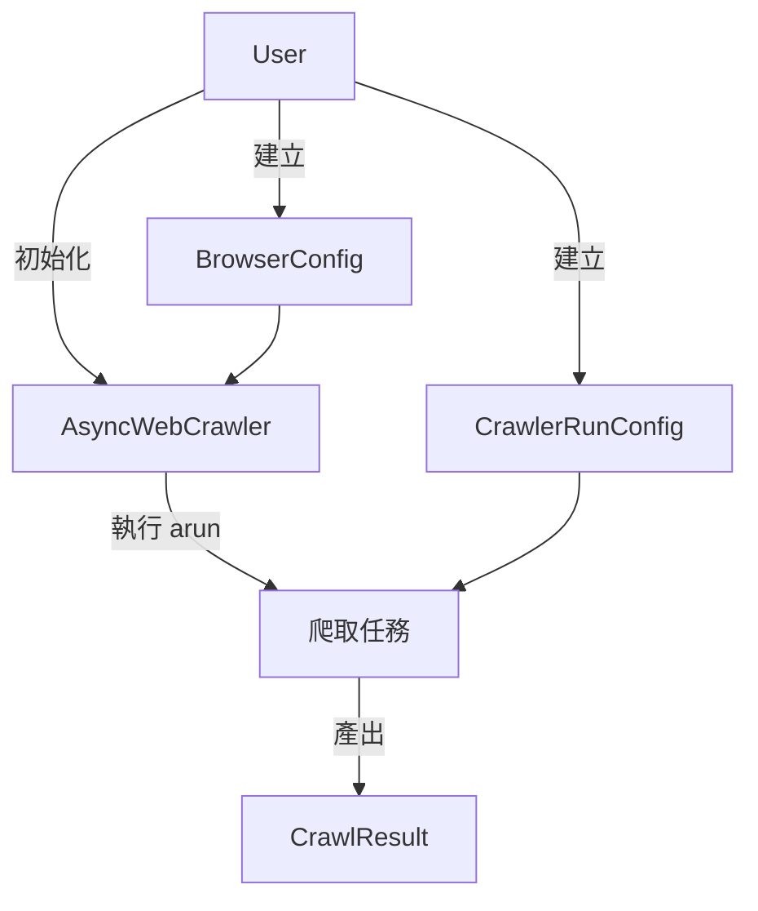

# Crawl4AI v0.7.7 主要實體 (Main Entities) 介紹

根據 `crawl4ai` v0.7.x (包含 0.7.7) 的文件，這個版本的架構更加物件導向，將設定參數封裝在專門的 Config 物件中。

以下是 `crawl4ai` v0.7.7 的主要實體及其功能介紹：

## 1. 核心控制類別 (Core Controller)

### `AsyncWebCrawler`
*   **角色**: 這是整個套件的入口點與指揮官。
*   **功能**: 負責管理瀏覽器生命週期（啟動/關閉）、執行爬取任務 (`arun` / `arun_many`)。
*   **用法**: 通常搭配 `async with` 使用，以確保資源正確釋放。

## 2. 設定類別 (Configuration Objects)
這是 v0.7.x 版本最重要的改變，將參數分組管理：

### `CrawlerRunConfig` (最常用)
*   **角色**: 定義「**這一次**」爬取任務的行為。
*   **內容**: 包含 CSS 選擇器 (`css_selector`)、JavaScript 等待條件 (`wait_for`)、快取模式 (`cache_mode`)、是否截圖、過濾策略等。
*   **使用時機**: 傳遞給 `crawler.arun(config=...)`。

### `BrowserConfig`
*   **角色**: 定義「**瀏覽器**」本身的環境設定。
*   **內容**: 是否使用無頭模式 (`headless`)、瀏覽器類型 (Chrome/Firefox)、User Agent、Proxy 設定等。
*   **使用時機**: 傳遞給 `AsyncWebCrawler(config=...)` 初始化時使用。

### `LLMConfig`
*   **角色**: 定義與 LLM (大型語言模型) 互動的設定。
*   **內容**: API Key、模型名稱 (provider/model)、Token 上限等。
*   **使用時機**: 當使用 LLM 進行提取或過濾時使用。

## 3. 資料與結果類別 (Data & Result)

### `CrawlResult`
*   **角色**: 爬取任務的執行結果。
*   **內容**: 
    *   `.markdown`: 轉換後的 Markdown 文字 (最核心的輸出)。
    *   `.html`: 原始 HTML。
    *   `.success`: 是否成功。
    *   `.extracted_content`: 結構化提取的資料 (JSON)。
    *   `.screenshot` / `.pdf`: 截圖或 PDF 檔案。

## 4. 策略與過濾器 (Strategies & Filters)
用於更精細地控制內容提取與清理：

### 提取策略 (Extraction Strategies)
*   **`JsonCssExtractionStrategy`**: 使用 CSS/XPath 定義規則來提取結構化資料 (不需 LLM，速度快)。
*   **`LLMExtractionStrategy`**: 使用 LLM 根據指令提取資料 (適合複雜非結構化內容)。
*   **`RegexExtractionStrategy`**: 使用正規表達式提取資料。

### 內容過濾器 (Content Filters)
*   **`PruningContentFilter`**: 根據演算法修剪掉不重要的節點 (如廣告、導覽列)，保留主要內容。
*   **`BM25ContentFilter`**: 基於關鍵字相關性 (BM25 演算法) 來保留相關的文字區塊。

## 5. 輔助列舉 (Enums)

### `CacheMode`
*   控制快取行為：
    *   `ENABLED`: 正常讀寫快取 (預設)。
    *   `DISABLED`: 不使用快取，每次都重新抓取。
    *   `BYPASS`: 這次抓取不讀快取，但可能會寫入。
    *   `READ_ONLY`: 只讀不寫。
    *   `WRITE_ONLY`: 只寫不讀。

## 6. 總結關係圖

