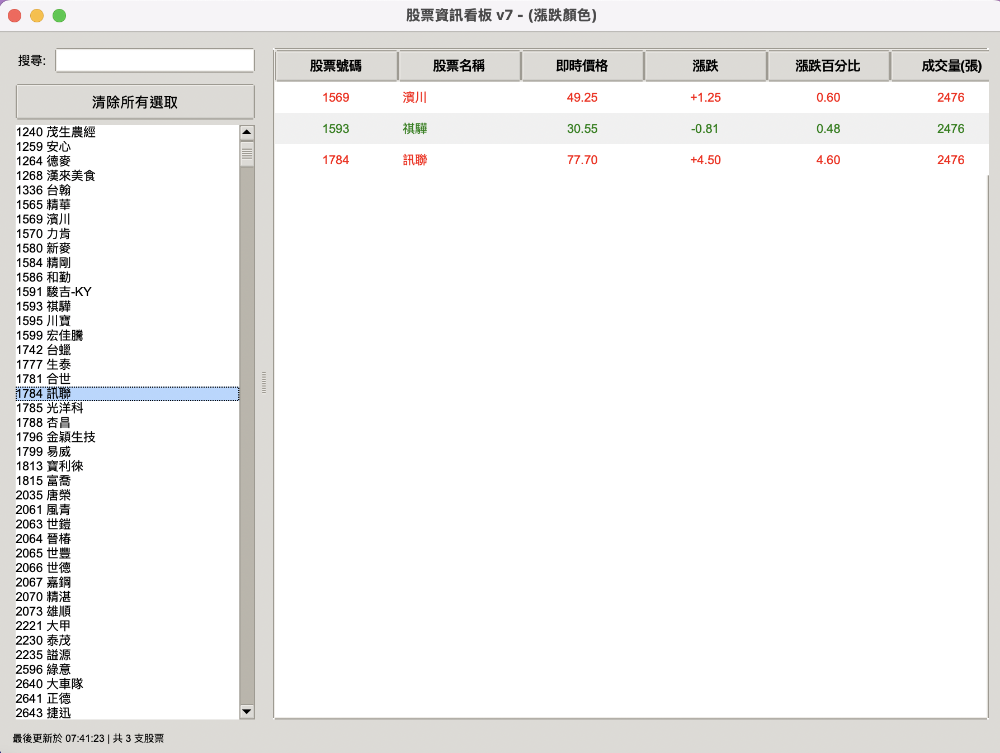

# 台灣即時股票資訊 - Tkinter GUI 版本



> ⚠️ **AI 產生專案說明**
> 本專案是由 AI 輔助開發的完整應用程式。從需求分析（PRD.md）到程式實作（main.py、wantgoo.py），都經過 AI 協助設計與生成。此專案展示了 AI 如何協助快速建立功能完整的桌面應用程式，適合作為學習 AI 輔助開發與桌面爬蟲應用的範例。

## 專案簡介

這是一個整合 **Crawl4AI 爬蟲** 與 **Tkinter GUI** 的完整桌面應用程式。相較於前兩個專案（專案 1 和專案 2）僅展示爬蟲功能，本專案提供了完整的使用者介面，讓使用者可以：

- 從股票列表中選擇多支股票
- 即時監控股票資訊（價格、漲跌、成交量等）
- 自動更新股票資料（每 60 秒）
- 視覺化呈現漲跌情況（紅漲綠跌）

**目標網站**: [玩股網](https://www.wantgoo.com/)

**主執行檔**: main.py

## AI 開發流程

本專案採用 AI 輔助開發的完整流程：

### 1. 需求分析階段
- **檔案**: PRD.md (Product Requirements Document)
- **內容**: AI 協助撰寫產品需求文件，定義功能、技術規格、非功能性需求
- **重點**:
  - 股票複選功能
  - 表格式資訊顯示
  - 自動更新機制
  - 使用者介面設計

### 2. 程式實作階段
- **主程式**: main.py - Tkinter GUI 主程式
- **爬蟲模組**: wantgoo.py - Crawl4AI 爬蟲邏輯
- **AI 協助**:
  - 程式碼生成
  - 錯誤修正
  - 效能優化
  - 介面美化

### 3. 文件撰寫階段
- **README.md**: 完整使用說明（AI 生成）
- **程式碼註解**: 清晰的函式說明
- **PRD.md**: 需求文件記錄

## 功能特色

### 核心功能
- ✅ **股票列表載入**: 自動載入台灣股市所有上市股票
- ✅ **多選功能**: 可同時選擇多支股票進行監控
- ✅ **即時資訊顯示**: 顯示股票號碼、名稱、價格、漲跌、成交量
- ✅ **自動更新**: 每 60 秒自動更新股票資訊
- ✅ **視覺化顯示**: 上漲顯示紅色，下跌顯示綠色
- ✅ **搜尋功能**: 快速搜尋股票代碼或名稱
- ✅ **狀態列顯示**: 顯示最後更新時間與股票數量

### 進階功能
- ✅ **持久化選擇**: 搜尋時保持已選擇的股票
- ✅ **非同步爬蟲**: 不阻塞 GUI，保持介面流暢
- ✅ **錯誤處理**: 網路錯誤時顯示友善提示
- ✅ **清除選擇**: 一鍵清除所有已選股票

## 環境需求

### Python 版本
- Python 3.8 或以上（建議使用 3.10+）

### 相依套件
```bash
pip install crawl4ai
pip install twstock  # 用於取得股票列表
```

## 專案結構

```
3台灣即時股票資訊_tkinter/
├── main.py              # 主程式（Tkinter GUI）
├── wantgoo.py           # 爬蟲模組（Crawl4AI）
├── PRD.md               # 產品需求文件（AI 生成）
└── README.md            # 本說明文件
```

## 使用方式

### 1. 安裝相依套件

```bash
# 安裝 Crawl4AI
pip install crawl4ai

# 安裝 twstock（台灣股票資訊套件）
pip install twstock
```

### 2. 執行程式

```bash
python main.py
```

### 3. 使用說明

#### 操作步驟

1. **搜尋股票**
   - 在左上方搜尋框輸入股票代碼或名稱
   - 列表會自動過濾符合的股票

2. **選擇股票**
   - 單擊：選擇單一股票
   - Ctrl+單擊：多選股票
   - Shift+單擊：範圍選擇

3. **查看資訊**
   - 選擇的股票會立即出現在右側表格
   - 顯示即時價格、漲跌幅等資訊
   - 紅色表示上漲，綠色表示下跌

4. **自動更新**
   - 程式會每 60 秒自動更新資料
   - 狀態列顯示最後更新時間

5. **清除選擇**
   - 點擊「清除所有選取」按鈕
   - 清空右側表格與左側選擇

## 與專案 2 的差異

| 特性 | 專案 2（命令列版） | 專案 3（GUI 版） |
|-----|------------------|----------------|
| **介面類型** | 命令列（純文字） | 圖形介面（Tkinter） |
| **使用方式** | 執行後顯示結果並結束 | 持續運行，互動式操作 |
| **股票選擇** | 修改程式碼指定股票 | 介面上直接選擇 |
| **多股監控** | 需修改程式碼 | 支援多選，即時新增 |
| **自動更新** | 不支援 | 每 60 秒自動更新 |
| **視覺化** | 純文字輸出 | 表格+顏色標記 |
| **搜尋功能** | 無 | 即時搜尋過濾 |
| **錯誤處理** | 顯示錯誤訊息 | GUI 對話框提示 |
| **開發複雜度** | ⭐⭐⭐⭐ 中級 | ⭐⭐⭐⭐⭐ 高級 |
| **AI 協助** | 無 | **完整 AI 輔助開發** |

## AI 輔助開發的優勢

### 1. 快速原型開發
- AI 根據需求快速生成完整程式框架
- 減少從零開始的開發時間
- 提供最佳實踐的程式結構

### 2. 程式碼品質
- AI 生成的程式碼包含完整錯誤處理
- 遵循 PEP 8 程式碼風格
- 包含詳細的註解說明

### 3. 問題解決
- 遇到 Bug 時，AI 協助除錯
- 效能優化建議
- 功能擴充指導

### 4. 學習資源
- 程式碼本身就是學習範例
- 理解 Tkinter GUI 設計模式
- 學習非同步程式設計

## 常見問題 (FAQ)

### Q1: AI 如何協助開發這個專案？

A: AI 協助的範圍包括：

1. **需求分析**: 撰寫 PRD.md，定義功能與規格
2. **架構設計**: 規劃程式結構與模組分工
3. **程式碼生成**: 生成 main.py 和 wantgoo.py 的主要程式碼
4. **問題解決**: 修正 Bug，優化效能
5. **文件撰寫**: 生成完整的說明文件

**AI 的角色**: 協助工具，而非完全取代開發者。開發者需要提供需求、驗證程式碼、調整細節。

### Q2: 為什麼程式啟動後會開啟瀏覽器視窗？

A: 因為 wantgoo.py 中使用了 `headless=False`。

**修改方式**（生產環境建議）:
```python
browserConfig = BrowserConfig(
    headless=True,   # 隱藏瀏覽器
    verbose=False    # 關閉詳細日誌
)
```

### Q3: 如何修改自動更新頻率？

A: 修改 main.py 中的 `schedule_next_update` 方法：

```python
def schedule_next_update(self):
    self.update_stock_data()
    self.after(60000, self.schedule_next_update)  # 60000 = 60秒
    # 修改這個數值（單位：毫秒）
    # 30000 = 30秒
    # 120000 = 2分鐘
```

**注意**: 不建議設定太短的更新頻率（< 30 秒），避免被網站視為攻擊。

### Q4: 可以同時監控多少支股票？

A: 理論上沒有限制，但實務上建議：

- **5-10 支**: 更新速度快，體驗流暢
- **10-20 支**: 可接受，更新需要較長時間
- **20+ 支**: 更新較慢，可能影響使用體驗

## 學習重點

### 適合學習者

本專案適合以下學習者：

1. **Python GUI 開發者**: 學習 Tkinter 完整應用
2. **網路爬蟲學習者**: 理解爬蟲與 GUI 的整合
3. **非同步程式設計**: 學習 asyncio + threading 結合
4. **AI 輔助開發**: 體驗 AI 協助開發的完整流程

### 核心技術點

- ✅ Tkinter GUI 設計（Treeview、Listbox、Frame 佈局）
- ✅ 非同步網路爬蟲（Crawl4AI + asyncio）
- ✅ 多執行緒程式設計（threading + queue 通訊）
- ✅ 事件驅動程式設計（GUI 事件處理）
- ✅ 資料視覺化（顏色標記、表格排版）
- ✅ 錯誤處理與使用者體驗優化
- ✅ AI 輔助開發流程（需求→設計→實作）

## 相關資源

### 官方文件
- [Tkinter 文件](https://docs.python.org/zh-tw/3/library/tkinter.html)
- [Crawl4AI GitHub](https://github.com/unclecode/crawl4ai)
- [twstock GitHub](https://github.com/mlouielu/twstock)

### 相關專案
- [實際案例 1: 台灣銀行牌告匯率](../1台灣銀行牌告匯率/) - 靜態網頁爬蟲入門
- [實際案例 2: 台灣即時股票資訊](../2台灣即時股票資訊/) - 動態網頁爬蟲
- [實際案例 4: 台灣即時股票資訊_tkinter](../4台灣即時股票資訊_tkinter/) - GUI 批次爬取版本

### AI 輔助開發資源
- PRD.md - 產品需求文件範本

## 注意事項與免責聲明

### 法律與道德規範

1. **遵守使用條款**: 使用前請閱讀目標網站的使用條款
2. **合理請求頻率**: 預設 60 秒更新一次，不建議設定更短
3. **個人使用為主**: 本專案僅供學習與個人使用
4. **資料使用限制**: 擷取的資料不得用於商業用途
5. **投資風險**: 股票資料僅供參考，不構成投資建議

### AI 生成程式碼的注意事項

1. **驗證程式碼**: AI 生成的程式碼需經過測試驗證
2. **理解邏輯**: 不應盲目使用，需理解程式運作原理
3. **安全性檢查**: 確認程式碼沒有安全漏洞
4. **客製化調整**: 根據實際需求調整 AI 生成的程式碼
5. **持續學習**: 透過 AI 生成的程式碼學習最佳實踐

### 技術限制

1. **即時性限制**: 爬蟲取得的資料可能有延遲
2. **資料準確性**: 以官方管道資料為準
3. **網站變更風險**: 目標網站結構變更可能導致爬蟲失效
4. **效能限制**: 同時監控太多股票會影響更新速度

## 版本歷史

- **v7** (2025-01): AI 輔助開發完成版
  - 完整的 GUI 介面
  - 多股票同時監控
  - 自動更新機制
  - 視覺化顏色標記
  - 搜尋與過濾功能
  - 完整的錯誤處理

## 貢獻與回饋

如有任何問題、建議或改進，歡迎提出 Issue 或 Pull Request。

**特別感謝**：
- Crawl4AI 團隊提供強大的爬蟲框架
- twstock 團隊提供台灣股票資料套件
- AI 技術使快速開發成為可能

---

**最後更新**: 2025-01-15
**作者**: Robert Hsu
**AI 協助**: Claude / ChatGPT
**授權**: MIT License
**學習難度**: ⭐⭐⭐⭐⭐ 高級
**專案類型**: 🤖 **AI 輔助開發完整專案**
